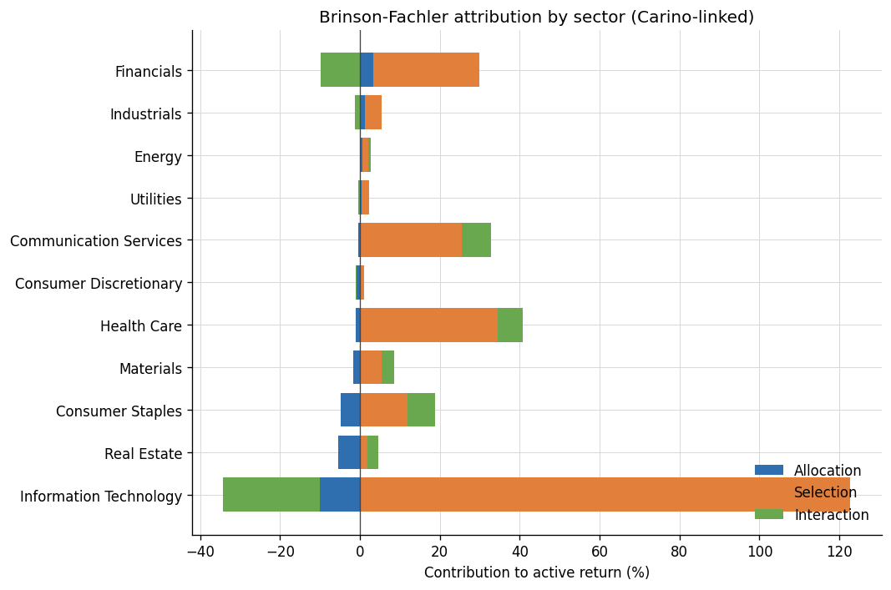
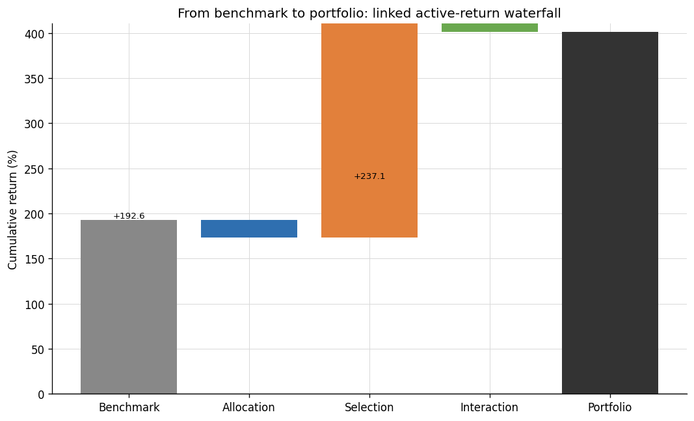
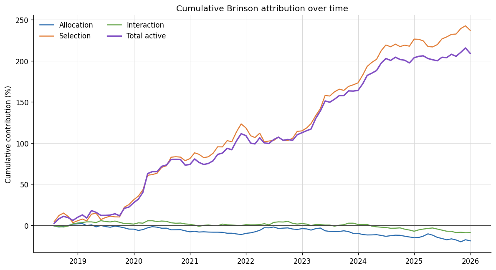
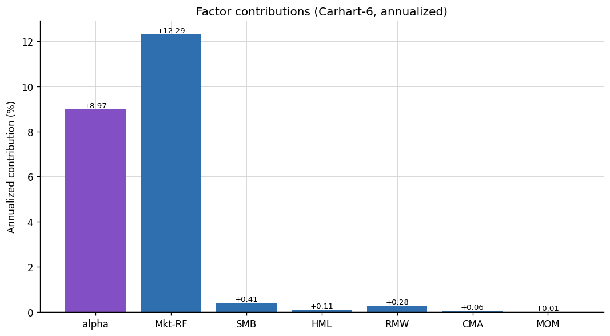
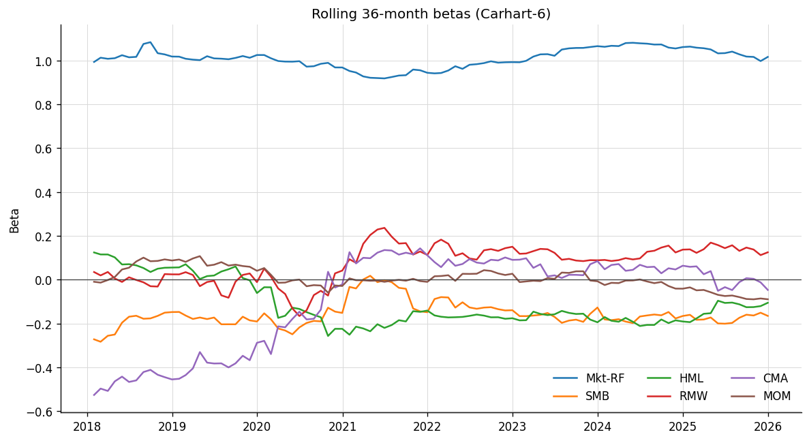

# Active Return Attribution Toolkit

When a portfolio beats its benchmark, the useful question is *why* — was it sector
positioning, security selection, or a factor tilt the manager may not even realize
they're taking? This project answers that from two complementary angles. Holdings-based
Brinson-Fachler attribution decomposes active return into allocation, selection, and
interaction effects by sector, geometrically linked across periods so the pieces
reconcile exactly to cumulative active return. Returns-based factor attribution
regresses the portfolio against CAPM, Fama-French 3/5-factor, and Carhart models to
separate factor exposure from genuine alpha, with Newey-West standard errors and
rolling betas to expose style drift. The two lenses are then tied back together, so a
sector overweight and its corresponding factor tilt tell a single, coherent story
rather than two disconnected tables.

In short — explain a US equity portfolio's performance **relative to its benchmark**
two complementary ways, and show that they tell one coherent story:

1. **Holdings-based Brinson-Fachler attribution** — decomposes active return into
   **allocation**, **selection**, and **interaction** by GICS sector, with proper
   **Carino geometric linking** so single-period effects compound *exactly* to the
   total multi-period active return.
2. **Returns-based factor attribution** — regresses portfolio, benchmark, and
   active returns on **CAPM / FF3 / FF5 / Carhart** factor models, reporting factor
   betas with **Newey-West** standard errors, annualized alpha, R², a
   factor-contribution decomposition, and rolling 36-month betas.

All attribution and regression math is implemented **from first principles with
numpy** (`statsmodels` appears only in the tests as an independent cross-check), so
every number is explainable end to end. **Real data only:** prices from yfinance,
factors from the Ken French Data Library.

---

## Why an analyst cares

These are the two questions an allocator or PM asks about active return, and they
have different answers:

| Question | Lens | What it isolates |
|---|---|---|
| *"Did we add value by over/under-weighting sectors, or by picking the right stocks within them?"* | **Brinson** (holdings) | Allocation vs. selection, sector by sector |
| *"Is the active return just compensation for style tilts (size, value, momentum), or is there genuine alpha?"* | **Factor model** (returns) | Systematic factor exposure vs. skill (alpha) |

The toolkit connects them: a **sector overweight** in the Brinson allocation term
is the *same bet* as a **style tilt** in the factor betas, and the Brinson
**selection** effect is the holdings-based cousin of factor **alpha**. Seeing both
projections of the same active return is what makes an attribution defensible.

---

## Methodology

### Module A — Brinson-Fachler (single period, per sector *i*)

With portfolio/benchmark sector weights `wp_i, wb_i`, portfolio/benchmark sector
returns `Rp_i, Rb_i`, and total benchmark return `Rb = Σ_i wb_i·Rb_i`:

```
Allocation_i  = (wp_i − wb_i) · (Rb_i − Rb)
Selection_i   = wb_i · (Rp_i − Rb_i)
Interaction_i = (wp_i − wb_i) · (Rp_i − Rb_i)

Σ_i (Allocation_i + Selection_i + Interaction_i) = Rp − Rb        (exact)
```

**Brinson-Fachler (BF) vs. Brinson-Hood-Beebower (BHB).** BHB's allocation term is
`(wp_i − wb_i)·Rb_i`; BF uses `(wp_i − wb_i)·(Rb_i − Rb)`, i.e. the sector return
*relative to the total benchmark*. The two differ only by `Rb·Σ_i(wp_i − wb_i) = 0`,
so the grand total reconciles either way — but BF is preferred because a sector that
merely tracks the index contributes ≈0 allocation regardless of its return level, so
the term cleanly measures the value of the **over/under-weight decision**.

### Multi-period linking — Carino (2009)

Single-period effects **cannot be summed** — returns compound geometrically, so a
naïve sum does not equal the compounded active return `Rp − Rb`. Carino rescales
each period's effects by `k_t / k`:

```
k_t = [ln(1+Rp_t) − ln(1+Rb_t)] / (Rp_t − Rb_t)      (limit 1/(1+Rp_t) as Rp_t→Rb_t)
k   = [ln(1+Rp)   − ln(1+Rb)]   / (Rp − Rb)          (cumulative)

Effect_linked = Σ_t (k_t / k) · Effect_t
```

Because `k_t·(Rp_t − Rb_t) = ln(1+Rp_t) − ln(1+Rb_t)` telescopes across periods, the
linked effects sum **exactly** to the compounded active return. (Menchero (2000) is
an alternative optimized-linking scheme with the same guarantee; Carino is used here
for its clean closed form.) The reconciliation is verified to ~1e-15 in the tests.

### Module B — Factor models

Dependent variables are monthly **portfolio excess** (`Rp − Rf`), **benchmark
excess** (`Rb − Rf`), and **active** (`Rp − Rb`) returns. Regressors:

| Model | Factors |
|---|---|
| CAPM | Mkt-RF |
| FF3 | Mkt-RF, SMB, HML |
| FF5 | Mkt-RF, SMB, HML, RMW, CMA |
| Carhart-4 | Mkt-RF, SMB, HML, MOM |
| Carhart-6 | Mkt-RF, SMB, HML, RMW, CMA, MOM |

Estimation (all hand-rolled in [`factor_model.py`](src/attribution/factor_model.py)):

```
β        = (XᵀX)⁻¹ Xᵀy                       (X includes an intercept = alpha)
Newey-West HAC covariance (Bartlett kernel):
   S     = Γ₀ + Σ_{l=1}^{L} (1 − l/(L+1))(Γ_l + Γ_lᵀ),   Γ_l = Σ_t (x_t e_t)(x_{t−l} e_{t−l})ᵀ
   Cov(β)= (XᵀX)⁻¹ S (XᵀX)⁻¹,   L = ⌊4·(T/100)^{2/9}⌋   (Newey-West rule of thumb)
```

Annualized alpha = monthly α × 12; t-stats from HAC standard errors. The
**return decomposition** attributes the average return to factors:
`mean(y) = α + Σ_k β_k·mean(f_k)`, with `contribution_k = β_k·mean(f_k)` (×12).
Rolling 36-month OLS betas visualize style drift.

---

## Data sources & caveats

| Input | Source | Notes |
|---|---|---|
| Prices | yfinance (auto-adjusted close → monthly simple returns) | Split/dividend adjusted; cached to `data/`. |
| Factors + RF | Ken French Data Library (FF5 2×3 + momentum), monthly | `pandas-datareader` primary, **direct CSV-zip download fallback**; percent → decimal. No API key. |
| Benchmark sector **returns** | 11 SPDR Select Sector ETFs (XLK, XLF, …, XLC) | Proxies for S&P 500 sector sleeves. |
| Benchmark sector **weights** | Static dated snapshot in [`configs/benchmark.yml`](configs/benchmark.yml) | See limitations. |

**Stated approximations (important):**

- **The Brinson benchmark is *reconstructed*** as `Σ_i wb_i·Rb_i` from the 11 sector
  ETFs and a **static** S&P 500 sector-weight snapshot. It therefore does **not**
  exactly equal SPY — the sample run shows a reconstructed-vs-SPY annualized tracking
  error of **≈1.4%**. This is an honest, quantified limitation, not a hidden one.
- **Static sector weights drift.** Real S&P 500 sector weights move materially over a
  decade (Information Technology rose from ~20% to ~30%+ across 2015–2025). A
  production system would use a monthly/quarterly weight time series (see Next steps).
- **Sector-ETF proxying.** GICS reclassifications (e.g. the 2018 creation of
  Communication Services / launch of XLC, and XLRE's late-2015 inception) truncate the
  usable Brinson window to **2018-07 onward**; ETF fees and tracking error make them
  imperfect stand-ins.
- Factor data lags ~1–2 months; the sample end is auto-capped to the latest month
  covered by **both** prices and factors.

---

## Install & run (one command each)

```bash
python -m venv .venv && source .venv/bin/activate
pip install -e ".[dev]"          # runtime + test/notebook extras

python -m attribution brinson    # sector attribution table + charts
python -m attribution factors    # factor-model tables + charts
python -m attribution report     # combined markdown + HTML report in reports/
pytest -q                        # 16 tests: reconciliation + SPY-β≈1 + statsmodels parity
```

Data is downloaded once and cached to `data/` (gitignored); later runs are offline.
The portfolio and benchmark are fully configurable in [`configs/`](configs/).

---

## Sample results

Portfolio: *Concentrated US Large-Cap Growth Tilt* (30 names), monthly, Brinson
window **2018-07 → 2025-12** (90 months), factor window **2015-02 → 2025-12**.

**Cumulative active return +209.0%**, decomposed by Brinson-Fachler:

| Effect | Linked contribution |
|---|---|
| Allocation | −19.1% |
| Selection | +237.1% |
| Interaction | −9.0% |
| **Total active** | **+209.0%** |

*Single-period reconciliation error `4.6e-17`; Carino-linked error `5.8e-15`.*





The active return is dominated by **stock selection in Information Technology and
Health Care** (holding NVDA/LLY-type names vs. their sector ETFs), not by sector
allocation. The factor lens agrees — most of the outperformance is **alpha**, not
factor beta:

| Model | Ann. alpha (active) | t | Mkt-RF | SMB | HML | MOM | R² |
|---|---|---|---|---|---|---|---|
| CAPM | +9.25% | 5.61 | 0.01 | — | — | — | 0.00 |
| FF3 | +8.70% | 6.94 | 0.02 | −0.08 | −0.15 | — | 0.30 |
| Carhart-6 | +8.58% | 6.74 | 0.03 | −0.07 | −0.14 | +0.02 | 0.31 |

The portfolio's Carhart-6 loadings (on **excess** return) are market β ≈ **1.00**
with a **growth tilt** (HML β ≈ −0.11) and **large-cap tilt** (SMB β ≈ −0.16) — the
same sector bets seen in Brinson, viewed through returns.




A full, regenerated write-up (with the reconciliation narrative) is produced at
`reports/report.html` by `python -m attribution report`. The
[demo notebook](notebooks/demo.ipynb) runs the whole thing end to end.

---

## Repository layout

```
src/attribution/
  data/{prices,factors,benchmark}.py   # yfinance + Ken French + reconstructed benchmark
  portfolio.py                         # drifting weights, quarterly rebalance, sector aggregation
  brinson.py                           # Brinson-Fachler + Carino linking (Module A)
  factor_model.py                      # OLS + Newey-West, contributions, rolling betas (Module B)
  plotting.py  report.py  pipeline.py  __main__.py
configs/{portfolio,benchmark}.yml      # fully configurable portfolio + benchmark snapshot
tests/                                 # reconciliation, weight dynamics, statsmodels parity
notebooks/demo.ipynb  docs/img/  reports/
```

---

## Limitations

- Static benchmark sector weights (a single dated snapshot); no intra-sample drift.
- Sector returns are ETF proxies, not the exact S&P 500 GICS sleeves; usable Brinson
  history starts 2018-07 due to XLC/XLRE inception.
- The reconstructed benchmark ≠ SPY (≈1.4% annualized tracking error, quantified).
- Arithmetic (×12) alpha annualization; no transaction costs, taxes, or cash drag in
  the portfolio simulation.
- Newey-West inference is large-sample; p-values use the normal approximation.

## Next steps

- Source a **time series** of S&P 500 sector weights (quarterly) to remove the static
  snapshot assumption and let benchmark weights drift.
- Add currency / multi-asset attribution and a fixed-income (duration/curve) module.
- Bootstrap / block-bootstrap confidence intervals for the attribution effects.
- Attribute at the **holding** level within each sector, and add a fundamental
  (Barra-style) risk-model overlay alongside the Fama-French returns-based one.

## License

MIT — see [LICENSE](LICENSE).
